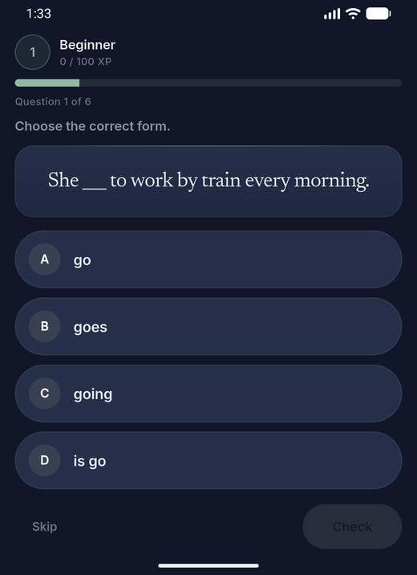
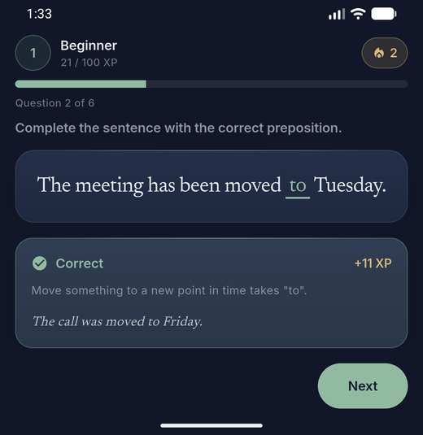
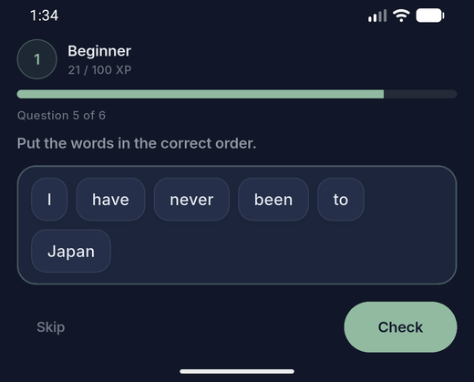
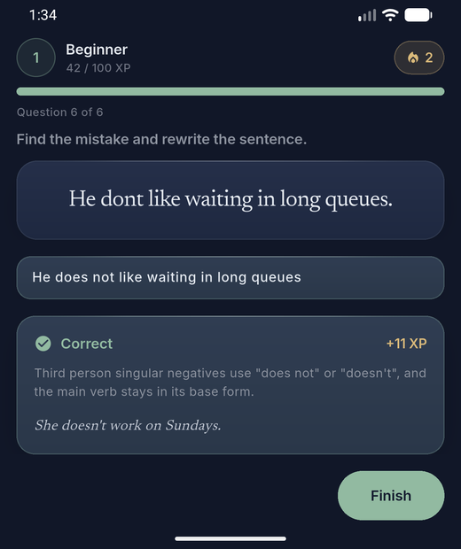
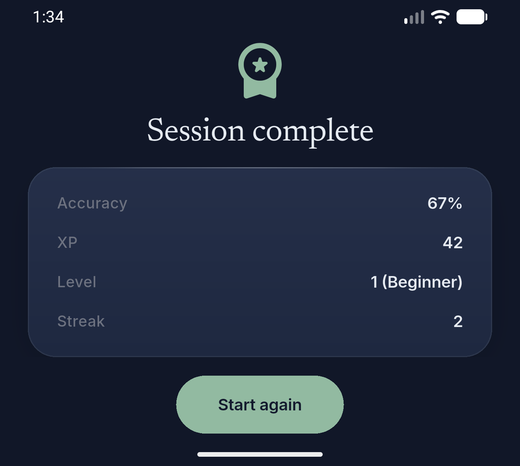

# Exercise Engine

A self-contained Flutter module that renders six different types of language
exercise through a single polymorphic interface, grades the answers, and drives
an XP and level progression system on top of the result.

Extracted from [Wordrill](https://wordrill.pl), a production English learning
app for Polish speakers. This repository is a portfolio sample: it runs on its
own, with mock content and no backend.

| Multiple choice | Inline blank | Word ordering |
|---|---|---|
|  |  |  |

| Sentence correction | Session summary |
|---|---|
|  |  |

```
flutter pub get
flutter run
```

## What it does

Six exercise types, one code path. The screen that drives a practice session
never branches on exercise type. It asks a factory for a renderer, hands it the
current answer, and gets an answer back through a callback.

| Type | Interaction |
|------|-------------|
| `multiple_choice` | Lettered option pills, tap to answer |
| `fill_in_gap` | Answer typed inline on the blank in the sentence |
| `translation` | Same inline blank, translated target |
| `word_formation` | Same inline blank, derived word form |
| `sentence_transformation` | Multi-line prompt, blank on the target line |
| `sentence_ordering` | Word bank, tap to place or drag to position |
| `sentence_correction` | Free rewrite, with a struck-through diff on failure |

Adding a seventh type means writing a widget and adding a case to the factory.
Nothing else in the session flow changes.

## Points of interest

**The answer never reaches the widget layer.** The model class is called
`SanitizedExercise` because that is what it is: prompt and options, with no
`isCorrect` flag on the options and no answer field anywhere on the object. The
answer key lives in a separate structure that only the grader touches. In the
production app that separation is a network boundary, and the key stays on the
server.

**Grading is not the client's job.** `LocalGrader` exists so this sample runs
without a backend. It mirrors the real contract, same inputs and same output
shape, and the class documents that treating it as authoritative in a real build
would be the bug it illustrates. Production computes XP, level and streak
server side, because anything the client can compute the client can also forge.

**Answer state is lifted out of the renderers.** A list child can be rebuilt,
recycled or scrolled out of existence, and state held inside one goes with it.
The session screen owns the answer; the renderers are controlled widgets that
report changes upward.

**Free-text grading normalizes before comparing.** Learners type the right
answer with the wrong shell constantly: a trailing full stop, a double space, a
stray capital. Grading on the raw string punishes typing rather than grammar,
so case, surrounding punctuation and whitespace runs are flattened first. A typo
inside the word is still wrong, which is the distinction that matters.

**Two themes, no branches.** Colours resolve through a `ThemeExtension` that
exposes semantic roles rather than values, so the same renderer works in light
and dark without a single `isDark` check in the widget tree, and a theme switch
interpolates instead of snapping.

**The interaction detail that took the longest.** In sentence ordering, a word
dragged forward from an earlier position needs its target index decremented,
because removing it first shifts every later index left by one. Without that,
the word lands one slot past where it was dropped. It is three lines and one
comment in `_placeAt`.

## Layout

```
lib/
  core/          Haptics and user-facing copy
  domain/        Models, XP curve, grader. Pure Dart, no Flutter imports
  theme/         Design tokens, type scale, theme extension
  widgets/       The renderers, the factory, the card primitive
  demo/          Mock content and the screen that drives a session
  main.dart
test/            Unit tests and widget tests over the session flow
android/         Platform scaffolding, so the sample runs as-is
```

`domain/` has no dependency on Flutter and is testable without a widget test.

## Built with

Flutter and Dart. No state management package: this module is self-contained
enough that `StatefulWidget` is the right tool, and reaching for more would be
overhead. The full app uses Riverpod, go_router and Drift, with a Supabase
backend of PostgreSQL and Edge Functions.

## Tests

```
flutter test
```

38 tests. Unit tests cover the XP curve and the grader: threshold boundaries,
answer normalization, streak behaviour and the level-up transition. Widget tests
drive a real session through the UI, checking that a tap grades, that XP and
streak update, that advancing resets the answer state, and that a wrong answer
clears the streak.

## About the source project

[Wordrill](https://wordrill.pl) is an English grammar and vocabulary trainer
built around the Polish secondary school exam. Flutter client, Supabase backend,
several thousand authored exercises.

This repository contains no credentials, no backend logic, no API contracts and
no user data. The content shown is written for the sample.

## License

Copyright 2026 Marcel Stepien. All rights reserved.

Published for portfolio review. Not licensed for reuse or redistribution.
